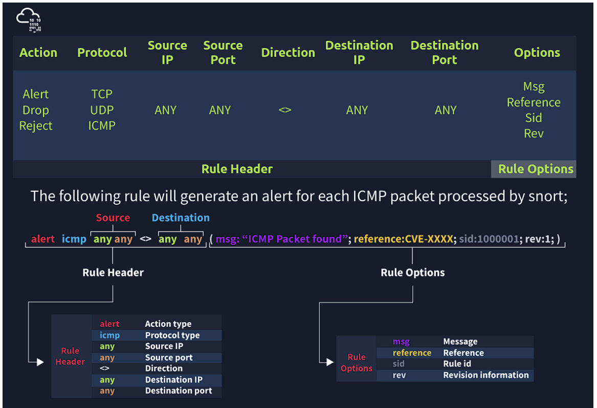

# Intrusion Detection System (IDS)

IDS is a passive monitoring solution for detecting possible malicious activities/patterns, abnormal incidents, and policy violations. It is responsible for generating alerts for each suspicious event. 

There are two main types of IDS systems;

- Network Intrusion Detection System (NIDS) - NIDS monitors the traffic flow from various areas of the network. The aim is to investigate the traffic on the entire subnet. If a signature is identified, an alert is created.
- Host-based Intrusion Detection System (HIDS) - HIDS monitors the traffic flow from a single endpoint device. The aim is to investigate the traffic on a particular device. If a signature is identified, an alert is created.

# Intrusion Prevention System (IPS)
IPS is an active protecting solution for preventing possible malicious activities/patterns, abnormal incidents, and policy violations. It is responsible for stopping/preventing/terminating the suspicious event as soon as the detection is performed.

 There are four main types of IPS systems;

- Network Intrusion Prevention System (NIPS) - NIPS monitors the traffic flow from various areas of the network. The aim is to protect the traffic on the entire subnet. If a signature is identified, the connection is terminated.
- Behaviour-based Intrusion Prevention System (Network Behaviour Analysis - NBA) - Behaviour-based systems monitor the traffic flow from various areas of the network. The aim is to protect the traffic on the entire subnet. If a signature is identified, the connection is terminated.

- Wireless Intrusion Prevention System (WIPS) - WIPS monitors the traffic flow from of wireless network. The aim is to protect the wireless traffic and stop possible attacks launched from there. If a signature is identified, the connection is terminated.
- Host-based Intrusion Prevention System (HIPS) - HIPS actively protects the traffic flow from a single endpoint device. The aim is to investigate the traffic on a particular device. If a signature is identified, the connection is terminated.

# Technique
1. Signature-Based
2. Behaviour-Based
3. Policy-Based

Snort can be deployed inline to stop these packets, as well. Snort has three primary uses: As a packet sniffer like tcpdump, as a packet logger — which is useful for network traffic debugging, or it can be used as a full-blown network intrusion prevention system. Snort can be downloaded and configured for personal and business use alike."

Main Components of Snort

- Packet Decoder - Packet collector component of Snort. It collects and prepares the packets for pre-processing. 
- Pre-processors - A component that arranges and modifies the packets for the detection engine.
- Detection Engine - The primary component that process, dissect and analyse the packets by applying the rules. 
- Logging and Alerting - Log and alert generation component.
- Outputs and Plugins - Output integration modules (i.e. alerts to syslog/mysql) and additional plugin (rule management detection plugins) support is done with this component. 